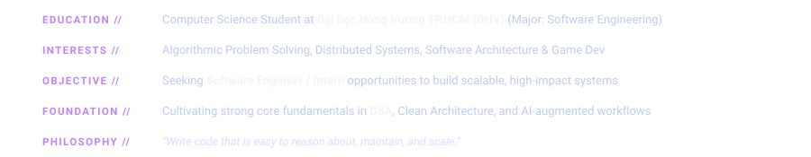

<!-------------------- NOTES --------------------!>
 - Những section-divider, thẻ nội dung không có nhiệm vụ chuyển hướng thì bọc bằng thẻ <a href="#stay"> để tránh bấm vào svg và bị chuyển hướng vào nguồn.
 - Những thẻ cần chuyển hướng thì cứ bọc trong thẻ <a> với đường dẫn bình thường.
<------------------------------------------------->

<!-- ========================================== -->
<!-- HERO HEADER                                -->
<!-- ========================================== -->

  <a href="https://github.com/MinkWungNe">
    <picture>
      <source media="(max-width: 768px)" srcset="./svg/00_header/header-banner-mobile.svg">
      
    </picture>
  </a>

  
  
  
  
  

<!-- ========================================== -->
<!-- SECTION 1: ABOUT ME                        -->
<!-- ========================================== -->

  

  <a href="#stay">
    <picture>
      <source media="(max-width: 768px)" srcset="./svg/01_aboutme/content-about-mobile.svg">
      
    </picture>
  </a>

<!-- ========================================== -->
<!-- SECTION 2: SKILLS                          -->
<!-- ========================================== -->

  

  <a href="#stay">
    <picture>
      <source media="(max-width: 768px)" srcset="./svg/02_skills/content-skills-mobile.svg">
      
    </picture>
  </a>

<!-- ========================================== -->
<!-- SECTION 3: PROJECTS                        -->
<!-- ========================================== -->

  

  <a href="https://github.com/MinkWungNe/Things_I_Learned">
    <picture>
      <source media="(max-width: 768px)" srcset="./svg/03_projects/card-project-things-i-learned-mobile.svg">
      
    </picture>
  </a>
  <a href="https://github.com/MinkWungNe?tab=repositories">
    <picture>
      <source media="(max-width: 768px)" srcset="./svg/03_projects/card-project-labs-mobile.svg">
      
    </picture>
  </a>

<!-- ========================================== -->
<!-- SECTION 4: STATS                           -->
<!-- ========================================== -->

  

  <a href="#stay">
    <picture>
      <source media="(max-width: 768px)" srcset="./svg/04_stats/stats-card-mobile.svg">
      
    </picture>
  </a>

  <a href="#stay">
    <picture>
      <source media="(prefers-color-scheme: dark)" srcset="https://raw.githubusercontent.com/MinkWungNe/MinkWungNe/output/github-contribution-grid-snake-dark.svg">
      <source media="(prefers-color-scheme: light)" srcset="https://raw.githubusercontent.com/MinkWungNe/MinkWungNe/output/github-contribution-grid-snake.svg">
      
    </picture>
  </a>

<!-- ========================================== -->
<!-- FOOTER                                     -->
<!-- ========================================== -->

  <samp>Crafted with Curiosity by <a href="https://github.com/MinkWungNe">MinkWungNe</a> &bull; Powered by Git &amp; Automation</samp>
  

